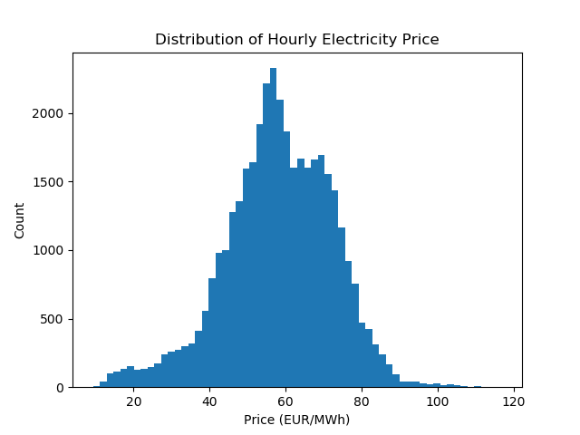
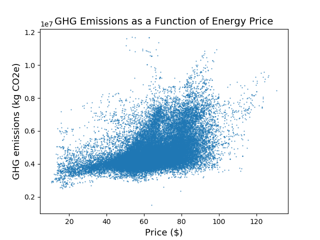

# Capstone 2: Energy Price Prediction <a name="Part-1"></a>
by Austin Zimmerman
- [Part 1](#Part-1)
    - [Motivation](#Motivation)
    - [Data](#Data)
    - [Pipeline and Workflow](#Pipeline)
    - [EDA](#EDA)
    - [Model Selection](#Model-Selection)
        - [Random Forest](#Random-Forest)
        - [SKLearn Pipline](#SKLearn-Pipeline)
    - [Interpretation](#Interpretation)
        - [Feature Importance](#Feature-Importance)
        - [Partial Dependence](#Partial-Dependence)
    - [Next Steps](#Next-Steps)
- [Part 2](#Part-2:-Continued-Model-Tuning-and-Greenhouse-Gas-Analysis)
    - [Model Performance](#Model-Performance)
    - [GHG and Price](#GHG-and-Price)
    - [Further Discussion](#Further-Discussion)


<p align="center">
       

## Motivation <a name="Motivation"></a> 

For many years, solar panels and wind turbines have been hailed as the harbinger of a renewable energy revolution that has only just very recently begun to take shape on a global scale.  The chief complaint from those hesitant to adopt or incorporate renewable energy sources was almost always their effect on energy prices.  At the time of writing, the world is engulfed in a novel Coronavirus pandemic that has shut down industry and social interaction around the globe.  As viral videos of crystal clear streams and suburban big cats make their way around the world, many are starting to think more seriously about our impact on the planet.

With a fair bit of inspiration from a [recent paper on *Tackling Climate Change with Machine Learning*](https://arxiv.org/abs/1906.05433) and encouragement from news stories like [this one](https://www.theguardian.com/business/2020/jun/02/energy-firms-urged-to-mothball-coal-plants-as-cost-of-solar-tumbles), I have made an effort to better understand the forces that act upon energy prices. In this analysis I endeavor to build a model that can predict energy prices based on generation and weather data and provide some insight as to how different sources affect those prices.

[(back to top)](#Part-1)


## Data <a name="Data"></a>
This publicly available dataset came in two seperate .csv files (weather and energy) posted on [Kaggle](https://www.kaggle.com/nicholasjhana/energy-consumption-generation-prices-and-weather#weather_features.csv) in late 2019.  Some previous work has been done wit this data to understand the effect of time on energy prices, but I was more interested in determining the effect of different energy generation mixtures and weather.  As such, the following analysis does not consider the effects of the time-series on price.


The combined dataset contained 178,000 rows of hourly data between January 2015 and Deember 2018. The target of my predictions was real-time energy price in EUR/MWh provided by the energy csv.


The weather dataset contained temperature, humidity, pressure, wind speed and more data for the 5 largest cities in Spain: Madrid, Barcelona, Valencia, Sevilla, Bilbao.

<p align="center">
       


This dataset was relatively clean save for the ' ' in front of 'Barcelona' in every row, as well as what appeared to be a broken pressure gauge for about a month in Barcelona.

The energy dataset concerned generation in MW for various energy sources throughout the country.  This dataset was incomplete in a few areas, namely that the 'generation fossil coal-derived gas', 'generation fossil oil shale', 'generation fossil peat', 'generation geothermal', and 'generation marine' contained only zeros, and 'generation hydro pumped storage aggregated' contained all null values. 

<p align="center">
       


## Pipeline and Workflow <a name="Pipeline"></a>

<p align="center">


I gave myself the challenge of working with the AWS suite on this project, taking the opportunity to gain familiarity with these widely used tools.  I stored my data and wrote results remotely into an S3 bucket, and did all model training and manipulation on the full dataset in an ubuntu t2.small EC2 instance with anaconda3 and git.  I wrote code mostly on my local machine, making small adjustments in vim on the EC2 instance when necessary.  I followed a basic git workflow, essentially treating my local and virtual machines as if they were partners working on the same project.

I created a Pipeline class to load data in from S3 (using the s3fs library) and apply the necessary cleaning and transformations.  I also worked a bit with SKlearn's built-in Pipeline class.  The biggest speed-bump at this stage was turning the 'city_name' feature into a series of features that represented weather data for each city.  While this solved the problem of having duplicate indices (one for each city at each timestamp), it sent my dimensionality skyward very quickly.


## EDA <a name="EDA"></a>

EDA turned out to be very useful for narrowing down my long list of features into something a bit less computationally expensive and more interpretable.

I had a suspicion that weather_description and weather_id were redundant as they contained a similar number of categories.  Some simple exploration confirmed this and found additional collinearity/sub categorization in the weather_main column, clear upon moderately close inspection:


| Weather Description          | Weather ID | Weather 'main' |
|------------------------------|------------|----------------|
| sky is clear                 | 800        | clear          |
| few clouds                   | 801        | clouds         |
| scattered clouds             | 802        | clouds         |
| broken clouds                | 803        | clouds         |
| overcast clouds              | 804        | clouds         |
| light rain                   | 500        | rain           |
| moderate rain                | 501        | rain           |
| heavy intensity rain         | 502        | rain           |
| light intensity shower rain  | 520        | rain           |
| heavy intensity shower rain  | 522        | rain           |
| shower rain                  | 521        | rain           |
| very heavy rain              | 503        | rain           |
| thunderstorm with heavy rain | 202        | thunderstorm   |
| thunderstorm with light rain |  200       | thunderstorm   |
| proximity thunderstorm       | 211        | thunderstorm   |
| thunderstorm                 | 211        | thunderstorm   |
| light intensity drizzle      | 300        | drizzle        |
| mist                         | 701        | mist           |
| fog                          | 741        | fog            |

weather_description and weather_id match nearly 1:1, and weather_main contains faily intuitive groupings of weather types.  I opted to one-hot encode weather_main and discard the other two to minimize dimensionality.


#### Correlation Matrix <a name="Correlation-Matrices"></a>

To avoid making a single, massive, unreadable correlation matrix with all of my features, I decided to add price to the weather DataFrame and make a separate, moderately-readable one for the subset.  When it comes to weather, it appears that wind speed and temperature are the only features which are routinely correlated with energy price (bottom row).


Energy

The energy dataset provides a much more visually interesting (and analytically helpful) matrix.  Lignite, gas, coal, and oil generation , along with total load, all appear positively correlated with price.  Meanwhile, onshore wind and pumped storage consumption appear to be negatively correlated with price.


<table>
<tr><th> </th><th> </th></tr>
<tr><td>


</td><td>



</td></tr> </table>
<table>
<tr><th> </th><th> </th></tr>
<tr><td>


</td><td>


</td></tr> </table>

[(back to top)](#Part-1)

### Model Selection <a name="Model-Selection"></a>

#### Random Forest <a name="Random-Forest"></a>
From the outset, I was planning on using a random forest regressor on this data.  After first running the regressor with default parameters, I quickly found that I could save on computation with very little increase in error.  The elbow of this MSE plot is around 10 estimators, and the MSE ++value is nearly the same as MSE at 100 estimators (the default).


A GridSearchCV reported 30 as the optimum number of estimators.  Running my RandomForest with 30 estimators produced surprisingly high r^2 scores for both my train and test data, **0.97** and **0.82** respectively.  These were good results, but I came away from them concerned that I had introduced some leakage that was causing my model to overfit.

#### SKlearn Pipeline <a name="SKlearn-Pipeline"></a>
To address these concerns, I used SKlearn's pipeline class to compare my random forest with 2 other models.  The similarity between results from the sklearn pipeline and my own reassured me that I had not caused any leakage with my treatment of the standardization and train-test-split in my custom pipeline.  


| Model                 | Train R^2 | Test R^2 | OOB Score   |
|-----------------------|-----------|----------|-------------|
| RandomForestRegressor | 0.97      | 0.83     | 0.81        |
| Lasso(alpha=0.03)     | 0.44      | 0.43     |             |
| LinearRegression      | 0.44      | 0.43     |             |


These results indicate that the relationships at play between the features and the target are not linear, and that in order to get highly interpretable results from a Linear Model, significant feature engineering would be required.


## Interpretation <a name="Interpretation"></a>
#### Feature Importance <a name="Feature-Importance"></a>
I hoped to gain insight into the effect of my features on energy price by plotting the feature importances for my RandomForestRegressor.  The results of this are shown below, with gas and coal generation leading the list, followed by total load (demand), hydropower, and a feature called 'generation other renewable' on which the data documentation sheds unfortunately little light.

* Not totally sure what is going on here? Check out the [documentation for Feature Importance](https://scikit-learn.org/stable/auto_examples/ensemble/plot_forest_importances.html).


#### Partial Dependence <a name="Partial-Dependence"></a>
While the feature importance shows the magnitude of a feature's effect on price, it does not tell us anything about directionality.  Partial dependence plots help to shed some light on how some of these features impact energy prices.

* Not sure how to interpret these graphs? Check out the documentation [here](https://scikit-learn.org/stable/modules/partial_dependence.html).


Here we see the top three most important features, each clearly with a positive effect on price.
<p align="center">


One of the most significant weather metrics in the dataset, wind speed in madrid has a strong negative correlation with energy price.

<p align="center">


Interesting step behavior with solar generation and some very strange behavior in the 'other' category.
<p align="center">


An interesting plot, hydro pumped storage just misses the top ten feature importances, but since it is often used in concert with renewables, it may have interesting implications for renewables.
<p align="center">


[(back to top)](#Part-1)
---


# Part 2: Continued Model Tuning and Greenhouse Gas Analysis <a name="Part-2"></a>

Throughout this section of the project I will be referring often to greenhouse gasses (GHGs), which are, simply put, the reason that our planet is warming at unprecedented rates.  GHGs trap the sun's heat within our atmosphere where it would usually escape into space, and they are a product of nearly all processes in industry, transportation, and electricity generation.

I had hoped originally to bring in data from the United states to make Part 1 a bit more applicable to myself and the people who may be interested in reading this analysis.  After spending quite some time wrestling with the data that was publicly available, I determined that bringing in nationwide data for the U.S. would not be feasible under the given time constraints.  While hourly energy data is certainly collected in the United States, the data presented back to the public is almost exclusively at a monthly or larger time-scale.

While I *was* able to bring in monthly U.S. data going back to 2012, it made up only 92 datapoints, not enough for a credible machine-learning based analysis.

Adding to this the fact that a similar weather analysis to the one in Spain would not be possible due to the size of the united states, I pivoted back to the Spain Data to see if any further model tuning could be acheived before undertaking my GHG analysis.  With an eye on returning to U.S. data in the future, I removed the weather data (the size of the U.S. makes weather from a few cities an impractical measure of pretty much anything) and reingineered several features to fit with the shape of the US data.


## Model Performance <a name="Model-Performance"></a>
Upon revisting this model, I had hoped to get a bit more performance out of it, mainly trying to reduce the gap between train and test error by tuning the hyperparameters.  Unfortunately, Trials of various values for max_depth, max_features, n_estimators, ccp_alpha could not close the gap without bringing both test and train scores into the neighborhood of 0.65.  I decided that a slightly overfit model would be preferable to a higher bias model that scored substantially worse.


## GHG and Price <a name="GHG-and-Price"></a>

I already had all of the data I needed to begin to make sense of the relationship between price and emission levels, I simply needed to perform a weighted sum of the values in each row and, voila, I would have a measure of how much GHG emission was produced for each point in my dataset.


Thanks to a 2014 IPCC report on the global warming potential associated with electricity generation sources, I had weights by which to multiply each feature of my dataset, and could calculate from there the total emissions for each row.

<center>

| Generation Source    | grams CO<sub>2</sub>e |
|----------------------|-----------------------|
| Coal                 | 820        
| Natural Gas          | 490        
| Biomass              | 230        
| Solar                | 48   
| Geothermal           | 38      
| Hydro                | 24         
| Nuclear              | 12         
| Wind                 | 11.5       

</center>

Here is a bit of pseudocode for the process. In practice, it is the dot product of the weights vector with the dataframe:

``` 
weights = [W1 + W2 + ... Wn]

for each row in dataset:
    (W1 x Col1) + (W2 x Col2) + . . . (Wn x Coln) = weighted sum


```


----


With these calculations taken care of, I can plot total emissions against energy price (converted to USD)

<p align="center">


My intuition is that if you showed this chart to someone as few as 15 years ago, they might have told you you'd gotten your axes wrong.  However, as the cost of building and operating renewable power plants has cratered in recent years, so too has the cost of low-carbon electricity.

This is already having drastic implications for solutions to what is recognized scientifically as one of the most dire problems facing humanity.  In the US, several states have adopted aggressive renewable energy goals with benchmarks as early as 2030.  As charts like this keep making their way onto the desks policy makers, they drastically improve the chances of turning electricity generation from a necessary evil into a flourishing economic sector, ripe with innovation and contributing *positively* to the survival of future generations.

[(Back to top)](#Part-1)


## Further Discussion <a name="Further-Discussion"></a>


For the year 2018


<table>
<tr><th>Spain </th><th>United States</th></tr>
<tr><td>

| Generation Source    | Billion kWH | Percent of Total |
|----------------------|-------------|------------------|
| Total                | 259         | 100%
| Coal and Natural Gas | 104         | 40%
| Nuclear              | 53          | 20%
| All Renewables       | 103         | 40%
| &nbsp;&nbsp;&nbsp;&nbsp;&nbsp;&nbsp;Wind                 | 50          | 19%
| &nbsp;&nbsp;&nbsp;&nbsp;&nbsp;&nbsp;Hydro                | 34          | 14%
| &nbsp;&nbsp;&nbsp;&nbsp;&nbsp;&nbsp;Solar                | 12          | 5%
| &nbsp;&nbsp;&nbsp;&nbsp;&nbsp;&nbsp;Biomass              | 7           | 3%
| &nbsp;&nbsp;&nbsp;&nbsp;&nbsp;&nbsp;Geothermal           | 0           | 0%


</td><td>

| Generation Source    | Billion kWH | Percent of Total |
|----------------------|-------------|------------------|
| Total                | 4204        | 100%
| Coal and Natural Gas | 2653        | 63%
| Nuclear              | 807         | 19%
| All Renewables       | 749         | 18%
| &nbsp;&nbsp;&nbsp;&nbsp;&nbsp;&nbsp;Wind                 | 273         | 6%
| &nbsp;&nbsp;&nbsp;&nbsp;&nbsp;&nbsp;Hydro                | 293         | 7%
| &nbsp;&nbsp;&nbsp;&nbsp;&nbsp;&nbsp;Solar                | 93          | 2%
| &nbsp;&nbsp;&nbsp;&nbsp;&nbsp;&nbsp;Biomass              | 75          | 2%
| &nbsp;&nbsp;&nbsp;&nbsp;&nbsp;&nbsp;Geothermal           | 16          | <1%


</td></tr> </table>


It is important to note that, in addition to the differences in both volume and distribution between Spain and the U.S., Spain does not possess any significant fossil resources of their own.  This is undoubtedly a contributing factor to the results in our price vs. emission plot and could serve as a potential roadblock to making this happen in the U.S.


   spain doesnt have any fossil resources of its own


Certainly, this general methodology can be applied to U.S. Data, but the substantial differences in energy mixtures between the two nations means that a new training process would be required.  When we compare the data side by side, it is not only scale, but proportion that sets the two countries apart.  No doubt, the Spain model has learned valuable information and could be useful for a transfer learning approach to the U.S. data.


## Next steps <a name="Next-Steps"></a>
#### Apply this model to U.S. Data
A this point we have a model that performs quite well at predicting energy prices given generation statistics and a few key weather metrics.  With a chance to expand on this process I would hope to apply this model to a united states dataset.  

[(Back to top)](#Part-1)


### Credits
https://www.eia.gov/energyexplained/energy-and-the-environment/where-greenhouse-gases-come-from.php


### Image credits:
https://energywatch-inc.com/electricity-pricing-influencers/

https://www.alicante-spain.com/images/map-of-spain.jpg

https://www.nwcouncil.org/news/megawatt-powerful-question

https://www.groupwaretech.com/Deploying-a-Golden-AMI-Pipeline-in-AWS-with-Ansible